# Xamarin Forms ADAL with multiple resources request
 
## 1. Setup Azure AD Auth on WebAPI (Azure App Services)
 Select web api App service in Azure. Under Settings Authentication/ Authorization
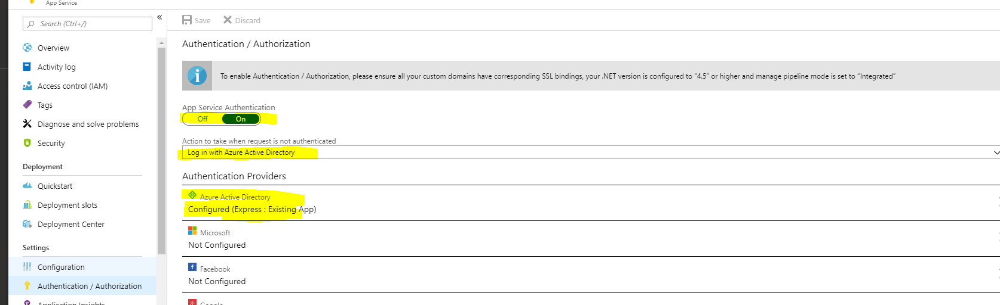
Select Express and press OK
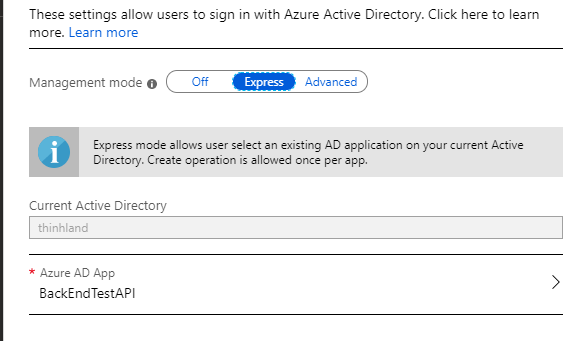

Selecting Express will automaticly add the web api app into Azure Active Directory.
Which can be found under Azure Active Directory / App registration
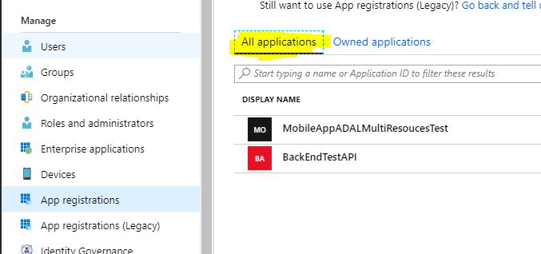

Select `BackEndTestAPI`, then select Redirect URIs:
 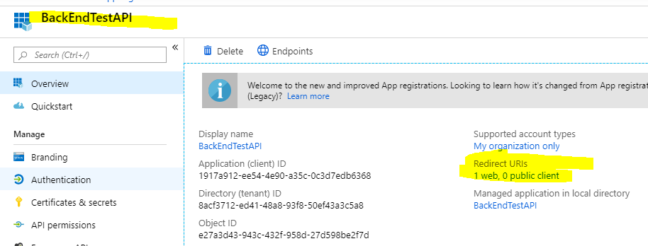
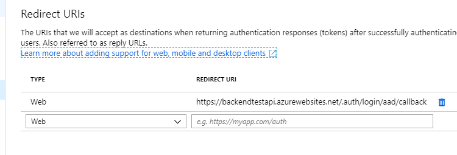

The redirect URI: `https://backendtestapi.azurewebsites.net/.auth/login/aad/callback` was autoset for
us using express mode.

Going to `https://backendtestapi.azurewebsites.net/` now will prompt you to login.

### Important:     Add Allowed Token Audiences
There is a bug in the `Express` options. It doesn't add the website URL in the allowed token audiences. 
(Hence, the granted accessToken for `https://backendtestapi.azurewebsites.net/` will still give unauthorized 401 error
when send request to it.)
Follow these steps to fix this bug:

* Go to the first website in Azure portal
* Click on the Authentication / Authorization blade
* Click on the Azure AD
* Change it from Express to Advanced
* In the Allowed Token Audiences add your website URL as shown below (eg: `https://backendtestapi.azurewebsites.net/`)
* Click OK
* Click Save

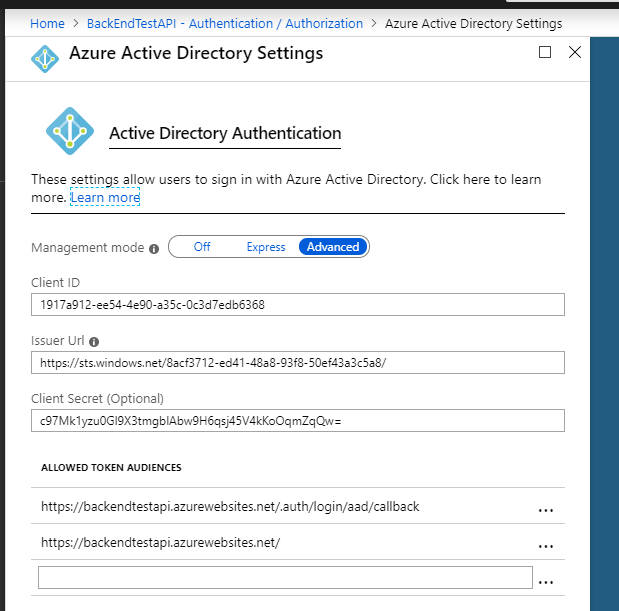

## 2.Register Azure Active Directory for Mobile App 

This is because Azure AD won’t issue access tokens to unknown clients. And We can authenticate ourselves directly in the browser, but the mobile can't yet.

Under Azure Active Directory / App registrations , Click `New Registration`
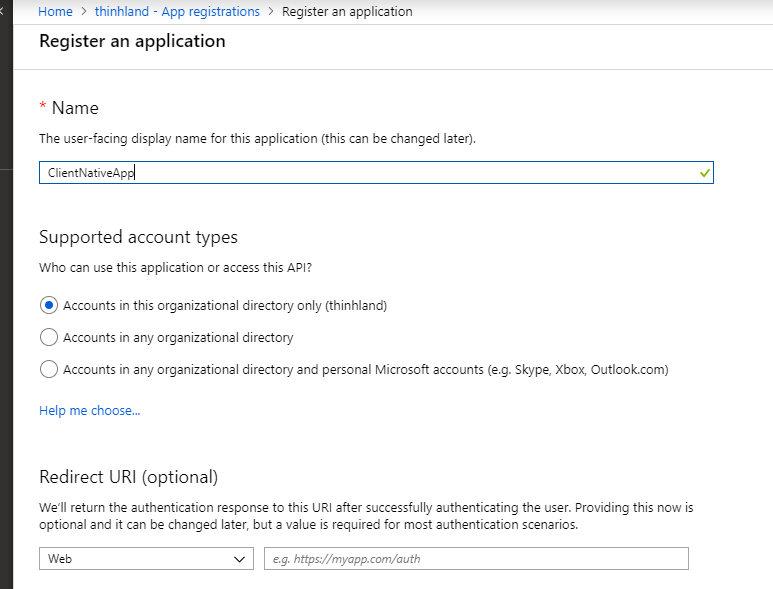

The App can now be found under Owned applications, since you created manually
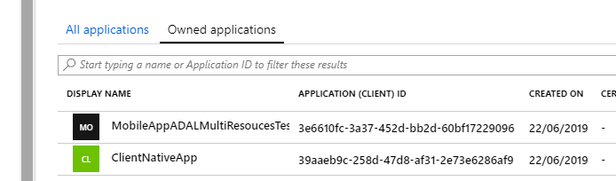

Click on the app, and under `Overview` set the Redirects URI that matched the redirect URI in step 1.

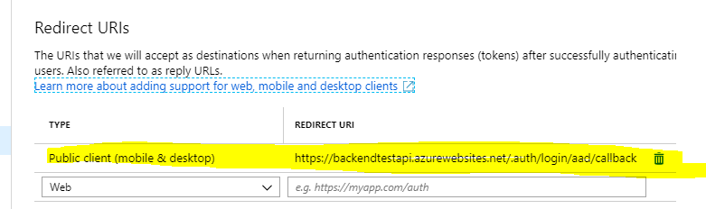

(Note: if this won't match the login screen will throw error doesn't set or not match URI).

Select the App/ API permissions
Click Add a permission
Select APIs my organization uses
Search for the name of the api(eg: `BackEndTestAPI`)

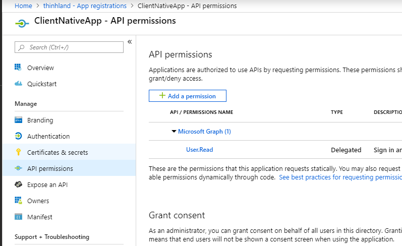
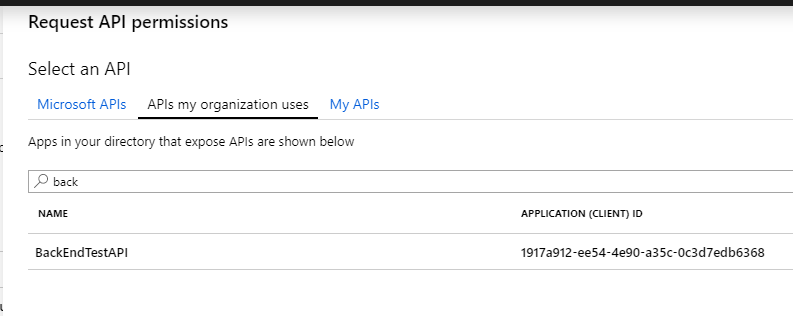

Select the app, tick `user_impersonation`
Click Add permissions_

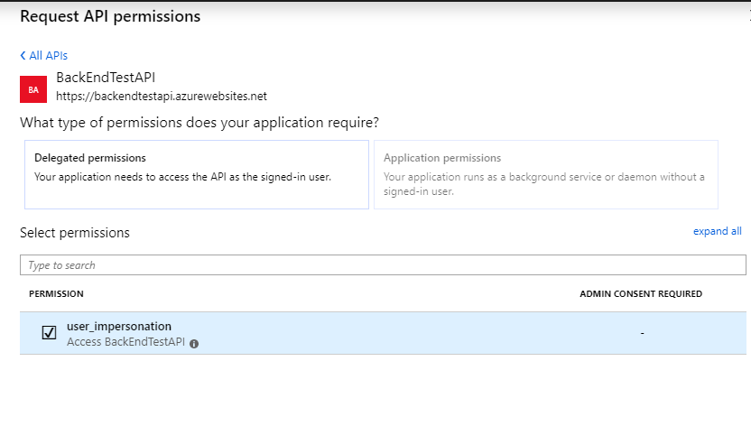

API permissions will now look like this:
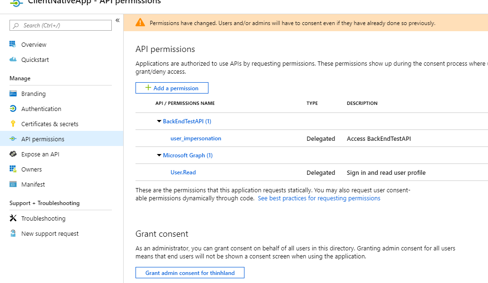

Another slightly different of using IPlatformParameters only instead of ILoginProvider : 
https://github.com/TimLariviere/WoodenMoose.Samples.Xamarin_Authentication

