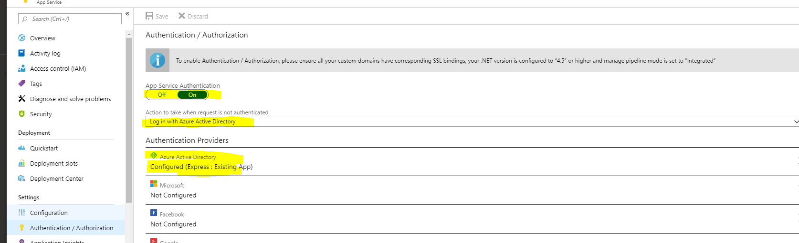
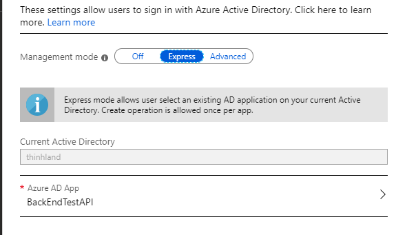
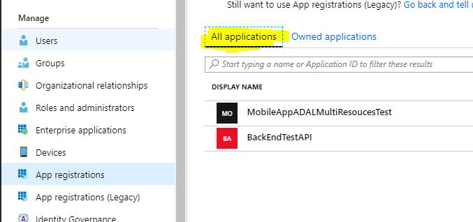
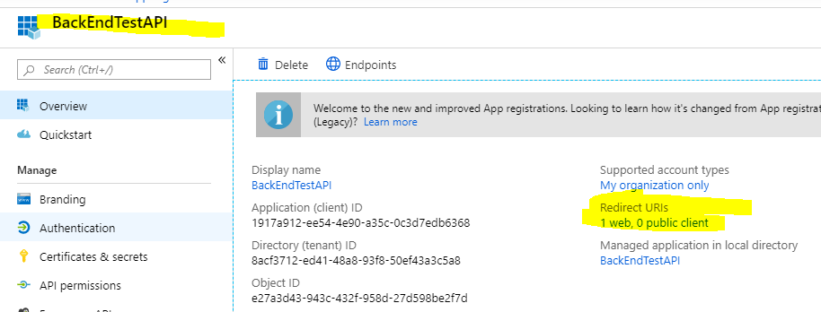
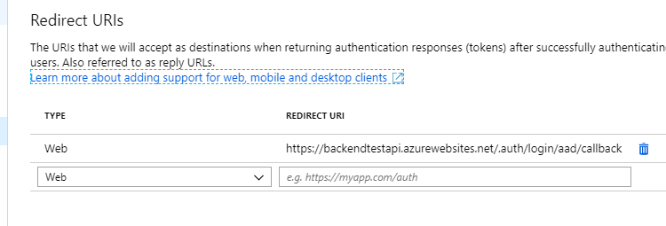
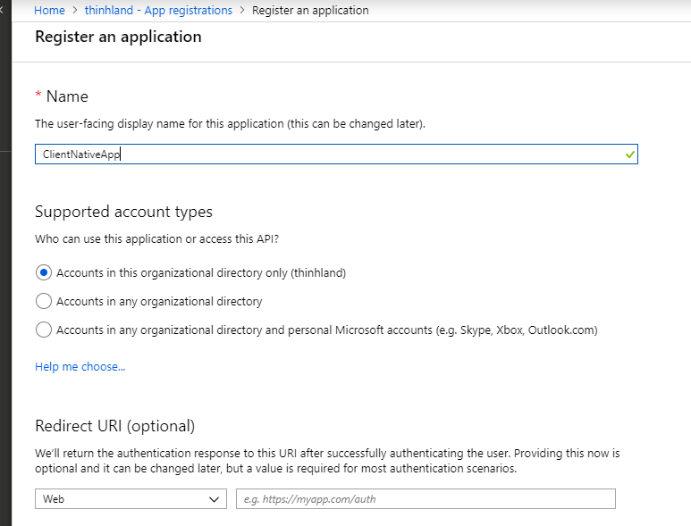
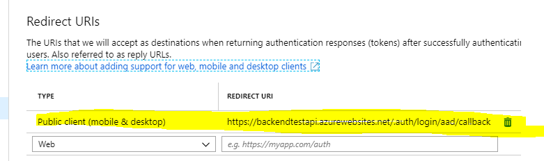

# Xamarin Forms ADAL with multiple resources request
 
## 1. Setup Azure AD Auth on WebAPI (Azure App Services)
 Select web api App service in Azure. Under Settings Authentication/ Authorization

Select express and press OK

Selecting express will automaticly add the web api app into Azure Active Directory.
Which can be found under Azure Active Directory / App registration

Select `BackEndTestAPI`, then select Redirect URIs:
 

The redirect URI: `https://backendtestapi.azurewebsites.net/.auth/login/aad/callback` was autoset for
us using express mode.

Going to `https://backendtestapi.azurewebsites.net/` now will prompt you to login.

## 2.Register Azure Active Directory for Mobile App 

This is because Azure AD won’t issue access tokens to unknown clients. And We can authenticate ourselves directly in the browser, but the mobile can't yet.

Under Azure Active Directory / App registrations , Click `New Registration`

The App can now be found under Owned applications, since you created manually

Click on the app, and set the Redirects URI that matched the redirect URI in step 1.

(note: if this won't match the login screen will throw error doesn't set or not match URI).

